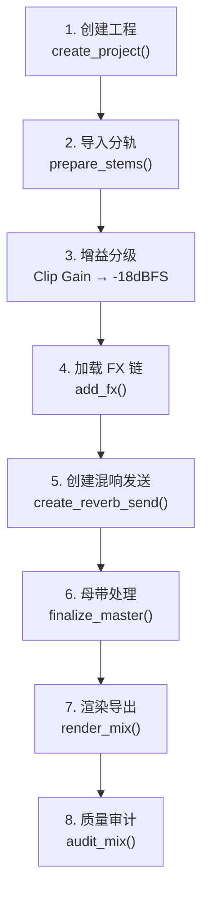
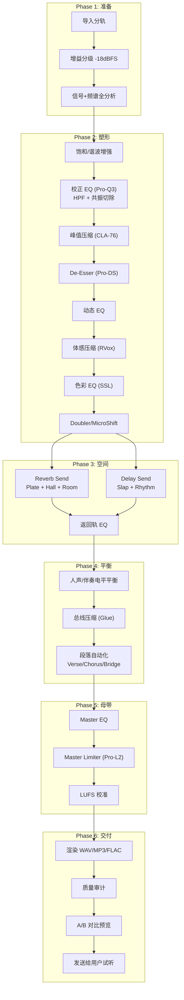
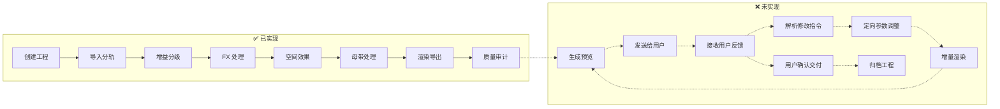

# Hermes-Core 综合分析与实施方案

> **项目版本**: v0.3.0 | **分析日期**: 2026-06-04  
> **分析范围**: 21个源文件 (~450KB)、24个测试文件 (~400KB)、13份文档

---

## 目录

1. [项目定位与命名](#1-项目定位与命名)
2. [混音师视角：工作流评估](#2-混音师视角工作流评估)
3. [代码架构评估](#3-代码架构评估)
4. [弹窗问题的彻底解决方案](#4-弹窗问题的彻底解决方案)
5. [安全性设计评估](#5-安全性设计评估)
6. [工作流闭环分析](#6-工作流闭环分析)
7. [功能缺失与优化清单](#7-功能缺失与优化清单)
8. [脱离 REAPER 自研 DAW 可行性分析](#8-脱离-reaper-自研-daw-可行性分析)
9. [具体实施方案](#9-具体实施方案)

---

## 1. 项目定位与命名

### 1.1 当前项目是什么？

hermes-core 是一个 **Python SDK/工具包（Toolkit）**，它通过 reapy 桥接 REAPER DAW，将高级混音意图转化为 REAPER 的底层 API 操作。它不是一个独立运行的应用，也不是一个 Agent——它是 **Agent 的"手和脚"**。

### 1.2 整体系统架构定位

```
┌─────────────────────────────────────────────────────────┐
│                    用户侧（手机端）                        │
│        飞书 / 微信 / 其他 IM                              │
└──────────────────────┬──────────────────────────────────┘
                       │ 自然语言消息
                       ▼
┌─────────────────────────────────────────────────────────┐
│              消息网关 / Webhook 服务                      │
│         接收 IM 消息，转发给 Agent                         │
└──────────────────────┬──────────────────────────────────┘
                       │ 结构化指令
                       ▼
┌─────────────────────────────────────────────────────────┐
│          AI Agent（Hermes Agent / Open Claw）             │
│    ● 理解用户意图（"帮我把人声调暖一点"）                     │
│    ● 规划混音策略                                         │
│    ● 调用 hermes-core API                                │
│    ● 多轮对话迭代修改                                      │
└──────────────────────┬──────────────────────────────────┘
                       │ Python API 调用
                       ▼
┌─────────────────────────────────────────────────────────┐
│              hermes-core（本项目）                        │
│    ● MixingEngine — 混音编排引擎                          │
│    ● ReaperBridge — REAPER 通信桥                        │
│    ● DialogKiller — 弹窗自动处理                          │
│    ● 信号分析 / 频谱分析 / 响度优化                         │
└──────────────────────┬──────────────────────────────────┘
                       │ ReaScript API
                       ▼
┌─────────────────────────────────────────────────────────┐
│                   REAPER DAW                             │
│    ● 宿主 VST/AU 插件                                    │
│    ● 音频渲染引擎                                         │
│    ● 工程文件管理                                         │
└─────────────────────────────────────────────────────────┘
```

### 1.3 推荐命名方案

| 组件 | 推荐名称 | 说明 |
|------|---------|------|
| **本项目（SDK）** | `hermes-core` ✅ 保持不变 | 核心引擎库，不对外暴露 |
| **Agent 服务** | `hermes-agent` | AI Agent 主体，负责意图理解和策略规划 |
| **消息网关** | `hermes-gateway` | 对接飞书/微信的消息中间件 |
| **整体产品** | **Hermes** 或 **赫尔墨斯混音助手** | 面向用户的品牌名 |

### 1.4 Agent 如何读取/使用本项目？

> [!IMPORTANT]
> hermes-core 应该作为 **Python 包被 Agent 直接 import**，而不是通过 CLI 调用。

**推荐集成方式：**

```python
# Agent 代码中：
from hermes_core import MixingEngine

with MixingEngine(watchdog=True) as engine:
    # Agent 根据用户意图调用 API
    engine.create_project("张三_望归_Mix")
    engine.prepare_stems(vocal="望归_Vocal.wav", backing="望归_伴奏.wav", genre="pop")
    engine.add_fx()
    engine.create_reverb_send()
    engine.finalize_master()
    result = engine.render_mix()
    
    # 返回结果给用户
    return result  # 包含渲染文件路径、LUFS 数据、频谱分析等
```

**但目前缺少 Agent 集成所需的关键组件：**

1. ❌ **无 Agent Protocol 层** — 没有定义 Agent ↔ hermes-core 的结构化通信协议（JSON-RPC、gRPC 等）
2. ❌ **无异步支持** — 所有操作都是同步阻塞的，Agent 无法在等待渲染时处理用户消息
3. ❌ **无进度回调系统** — Agent 无法向用户报告"正在渲染第3轨，进度60%"
4. ❌ **无操作审计日志** — 无法向用户回溯"我做了哪些调整"
5. ❌ **无中间预览机制** — 无法在混音过程中生成快速预览给用户试听

---

## 2. 混音师视角：工作流评估

### 2.1 当前工作流（已实现）



### 2.2 ✅ 做得好的地方

| 方面 | 评价 | 细节 |
|------|------|------|
| **增益分级** | ⭐⭐⭐⭐⭐ | -18dBFS RMS 参考电平，符合模拟设备校准标准 |
| **压缩器策略** | ⭐⭐⭐⭐⭐ | 基于 Crest Factor 自动推导压缩参数，CLA-76 + RVox 双层压缩（峰值+体感），非常专业 |
| **流派参数表** | ⭐⭐⭐⭐ | 6个流派的完整参数矩阵（folk/ballad/pop/rock/electronic/chinese_folk_bel_canto），数值合理 |
| **空间效果设计** | ⭐⭐⭐⭐ | 基于信号分析的自适应发送量，考虑了 crest_bias、density_bias、presence_bias、sibilance_bias |
| **母带响度优化** | ⭐⭐⭐⭐ | 二分查找 + Pro-L 2 + 校准偏移补偿，LUFS 精度 ±0.3 |
| **DAG 依赖解析** | ⭐⭐⭐⭐ | FX 链序关系正确（Gate → EQ → Comp → Spatial → Send → Limit） |
| **EQ 分段设计** | ⭐⭐⭐⭐ | Pre-Comp（校正性 EQ，Pro-Q 3）→ Post-Comp（色彩性 EQ，SSL EQ）的分段思路专业 |

### 2.3 ⚠️ 从混音师角度的问题

#### 问题 1：缺少人声处理的关键环节

```diff
  当前链路：Pro-Q 3 → CLA-76 → Pro-DS → SSL EQ → RVox
  
+ 缺少：
+ ● 饱和/谐波增强（Saturation） — 录音棚级处理第一步
+   推荐：Soundtoys Decapitator / FabFilter Saturn 2
+ ● 动态 EQ（Dynamic EQ） — 处理共振频率比静态 EQ 更精准
+   推荐：FabFilter Pro-Q 3 动态模式 / Waves F6
+ ● Doubler/MicroShift — 增加人声宽度和空间感
+   推荐：Soundtoys MicroShift / iZotope Vocal Doubler
```

> [!NOTE]
> 文档 [MIXING_KNOWLEDGE_BASE.md](file:///Users/zhaojin/hermes-core/docs/MIXING_KNOWLEDGE_BASE.md) 中已经详细描述了完整的9级人声处理链，但代码只实现了其中5级。

#### 问题 2：伴奏处理几乎为空白

当前系统假设伴奏是一个已混好的立体声文件（只做增益平衡），但实际场景中：
- 分轨伴奏（drums、bass、guitar、keys 分开）需要各自独立处理
- 需要伴奏总线压缩（Glue Compression）
- 需要伴奏与人声的频率互让（Sidechain EQ / 频率避让）

#### 问题 3：缺少 A/B 对比机制

混音师做完调整后一定会 A/B 对比（bypass 前后），当前系统：
- ❌ 无法快速对比"加压缩前 vs 加压缩后"
- ❌ 无法对比不同风格（"温暖版 vs 明亮版"）
- ❌ 无参考曲匹配（Reference Track Matching）

#### 问题 4：缺少自动化（Automation）支持

专业混音大量依赖自动化：
- 人声音量自动化（主歌 vs 副歌电平差异）
- 混响发送自动化（副歌比主歌多3dB混响）
- Pan 自动化（和声的动态平移）

当前系统只支持静态参数设置，`_SECTION_BOOST` 字典虽然有 verse/chorus/bridge 的差异化设计，但没有实际的自动化写入机制。

#### 问题 5：频谱分析的建议与执行断层

[spectrum.py](file:///Users/zhaojin/hermes-core/src/hermes_core/spectrum.py) 能检测共振、泥浆比、亮度缺失等问题，但：
- 分析结果只用于调整空间效果发送量
- 没有反馈到 EQ 参数调整（"检测到 400Hz 共振 → 自动切除"）
- `suggest_eq()` 方法存在但与 Intent 系统没有联动

### 2.4 混音工作流完善建议总结



---

## 3. 代码架构评估

### 3.1 当前三层架构

```
Layer 1 (Bridge):     bridge.py — REAPER 连接 + 弹窗处理
Layer 2 (Managers):   fx.py, track.py, bus.py, send.py, render.py
Layer 2.5 (Analysis): signal.py, spectrum.py, normalize.py
Layer 3 (Engine):     engine.py — 混音编排引擎 (4441行 GOD OBJECT)
Meta:                 project_meta.py, dag.py, profiles.py
```

### 3.2 🔴 关键架构问题

#### 问题 1：engine.py 是 God Object（最严重）

[engine.py](file:///Users/zhaojin/hermes-core/src/hermes_core/engine.py) 有 **4441 行代码**，其中：
- ~560 行模块级常量和字典（流派参数表）
- ~600 行辅助函数（压缩器参数转换器）
- ~3200 行 `MixingEngine` 类，包含 40+ 方法

这个类同时负责：项目管理、分轨准备、增益分级、FX 链构建、EQ 推导、压缩、空间效果、总线压缩、母带处理、预览渲染、校准等。**严重违反单一职责原则**。

**推荐拆分方案：**

```
engine.py (4441行) → 拆分为：
├── engine.py          (300行) — 编排入口，只做 facade/调度
├── gain_staging.py    (200行) — 增益分级逻辑
├── eq_engine.py       (400行) — EQ 意图 → 参数转换
├── comp_engine.py     (500行) — 压缩参数推导 + 翻译器
├── spatial_engine.py  (400行) — 空间效果发送 + 插件参数
├── mastering.py       (300行) — 母带处理 + LUFS 校准
├── genre_tables.py    (300行) — 所有流派参数表 (→ 或外置 YAML)
├── plugin_registry.py (200行) — 插件名映射 + 优选/回退链
└── preview.py         (150行) — 预览渲染 + A/B 对比
```

#### 问题 2：错误处理不一致

```python
# 有些方法返回 error dict：
def finalize_master(self) -> dict:
    return {"error": "Probe render failed", "passed": False}

# 有些方法抛异常：
def prepare_stems(self):
    raise RuntimeError("No vocal stem found")

# 有些方法返回 None：
def get_track_info(self, idx):
    return None  # track not found
```

> [!WARNING]
> 需要统一错误处理策略：对可恢复的操作返回 Result 类型，对不可恢复的操作抛出 `HermesError` 子类。

#### 问题 3：无状态机保护

当前方法的调用顺序依赖开发者记忆：
```python
# 必须按这个顺序调用，但没有强制检查：
create_project() → prepare_stems() → add_fx() → finalize_master()
```

`_stems_gain_staged` 和 `_master_finalized` 是手动的幂等性标志，但缺少完整的状态机：

```python
# 推荐实现：
class PipelineState(Enum):
    CREATED = "created"
    STEMS_PREPARED = "stems_prepared"
    FX_APPLIED = "fx_applied"
    SPATIAL_APPLIED = "spatial_applied"
    MASTERED = "mastered"
    RENDERED = "rendered"

# 每个方法检查前置状态：
def add_fx(self):
    self._require_state(PipelineState.STEMS_PREPARED)
    # ...
    self._state = PipelineState.FX_APPLIED
```

#### 问题 4：死代码和自引用反模式

- [signal.py](file:///Users/zhaojin/hermes-core/src/hermes_core/signal.py) 和 [spectrum.py](file:///Users/zhaojin/hermes-core/src/hermes_core/spectrum.py) 都有 `_read_pcm()` 和 `_to_mono()` 的重复实现，与 [audio_utils.py](file:///Users/zhaojin/hermes-core/src/hermes_core/audio_utils.py) 重复
- `engine.py` 内部多处 `from hermes_core.engine import _apply_proq3_eq` 自引用——在同一文件中完全不必要
- [engine.py#L1481](file:///Users/zhaojin/hermes-core/src/hermes_core/engine.py#L1481) 有连续两个 `raise` 语句（第二个不可达）

#### 问题 5：缺少抽象层

- **插件抽象缺失**：插件名硬编码在代码中（"VST3: FabFilter Pro-Q 3"），分散在 engine.py、normalize.py、profiles.py 多处
- **DAW 抽象缺失**：所有操作直接调用 REAPER API，无法适配其他 DAW
- **平台抽象缺失**：DialogKiller 使用 AppleScript，仅支持 macOS

### 3.3 ✅ 架构做得好的方面

| 方面 | 评价 |
|------|------|
| 三层分离（Bridge → Manager → Engine） | 设计思路正确 |
| DAG 依赖系统 ([dag.py](file:///Users/zhaojin/hermes-core/src/hermes_core/dag.py)) | 干净、聚焦、单一职责 |
| 异常层次结构 ([exceptions.py](file:///Users/zhaojin/hermes-core/src/hermes_core/exceptions.py)) | 设计合理 |
| reapy 懒加载 | 避免了导入时副作用 |
| UI 刷新锁（嵌套安全） | bridge.py 的 `lock_ui()`/`unlock_ui()` 设计稳健 |
| atexit 紧急清理 | 崩溃恢复机制到位 |

### 3.4 测试覆盖评估

**整体：⭐⭐⭐⭐ (Very Good)**

- 24 个测试文件，287+ 测试用例
- 单元测试覆盖率 ~82%
- 所有测试均使用 Mock Bridge，无跳过/预期失败标记
- **关键缺失**：无集成测试（不连接真实 REAPER）、无性能测试、无并发测试

---

## 4. 弹窗问题的彻底解决方案

### 4.1 当前实现分析

[bridge.py](file:///Users/zhaojin/hermes-core/src/hermes_core/bridge.py) 中的 `DialogKiller` 已经是一个相当完善的实现：

**✅ 已实现：**
- 后台守护线程，0.5秒轮询
- 三级弹窗分类（safe / diagnosis / unknown）+ 两类豁免（never / save）
- AppleScript 检测窗口标题和按钮
- 智能按钮选择策略（Safe→OK/Close, Save→No/Don't Save, Unknown→激进关闭）
- AppleScript 注入防御
- 事件记录（最近200条）
- 线程安全

### 4.2 仍然存在的漏洞

#### 漏洞 1：仅 macOS 可用

`DialogKiller` 完全依赖 AppleScript（`osascript`），在 Windows/Linux 上无法工作。

**修复方案：抽象化 + 多平台后端**

```python
class DialogHandler(ABC):
    """Platform-agnostic dialog handler interface."""
    @abstractmethod
    def inspect_windows(self) -> list[tuple[str, list[str]]]: ...
    @abstractmethod
    def click_button(self, title: str, button: str) -> bool: ...
    @abstractmethod
    def send_escape(self) -> bool: ...

class MacOSDialogHandler(DialogHandler):
    """Current AppleScript implementation."""
    ...

class WindowsDialogHandler(DialogHandler):
    """pywinauto / win32gui implementation."""
    ...

class LinuxDialogHandler(DialogHandler):
    """xdotool / wmctrl implementation."""
    ...
```

#### 漏洞 2：轮询间隔可能错过快速弹窗

0.5秒的轮询间隔意味着弹窗可能存在最多0.5秒。某些 REAPER 操作在弹窗出现后立即阻塞，导致后续 API 调用超时。

**修复方案：** 在关键操作前后主动检测

```python
def _with_dialog_guard(self, fn, *args, timeout=30):
    """Execute fn() with active dialog monitoring."""
    # 1. 操作前清除已有弹窗
    self._dialog_killer._dismiss_dialogs()
    # 2. 执行操作（带超时）
    ok, result = self.call_rpc(fn, *args, timeout=timeout)
    if not ok:
        # 3. 超时 → 可能被弹窗阻塞 → 再次清除
        self._dialog_killer._dismiss_dialogs()
        time.sleep(0.3)
        ok, result = self.call_rpc(fn, *args, timeout=timeout)
    return ok, result
```

#### 漏洞 3：未覆盖的弹窗场景

| 弹窗类型 | 触发条件 | 当前处理 | 建议 |
|---------|---------|---------|------|
| 插件授权失效 | iLok/R2R 过期 | `diagnosis` 分类，关闭 | ✅ 足够 |
| 采样率不匹配 | 项目与音频采样率不同 | 未覆盖 | 添加到 `_KNOWN_SAFE_PATTERNS` |
| 媒体文件离线 | 文件路径变更 | `_NEEDS_DIAGNOSIS` 中有 "Media offline" | ✅ 但应自动重定位 |
| REAPER 更新提醒 | 版本检测 | 未覆盖 | 添加 "Update Available"/"新版本" |
| 插件扫描进度 | 首次加载新插件 | `_NEEDS_DIAGNOSIS` 中有 "plugin scan" | ✅ |
| macOS 权限弹窗 | 首次运行辅助功能 | 无法通过 AppleScript 处理 | 需要系统级配置 |
| **渲染完成确认** | 渲染后弹出 | 未覆盖 | 添加 "Rendering complete" |
| **保存格式选择** | 另存为时 | 未覆盖 | 预设渲染格式避免触发 |

### 4.3 彻底方案：消灭弹窗于源头

> [!TIP]
> [REAPER_Agent_Project_Management_Spec.md](file:///Users/zhaojin/hermes-core/REAPER_Agent_Project_Management_Spec.md) 中的核心哲学是正确的：**"不是设计如何处理弹窗，而是设计为什么会出弹窗，然后从流程上消灭它们。"**

| 弹窗来源 | 消灭方法 |
|---------|---------|
| 保存提示 | 每步操作后自动保存 (`reaper.Main_SaveProject(0)`) |
| 文件覆盖 | 自动版本号命名（v01/v02/v03） |
| 缺失文件 | 导入时强制 Copy to Project，本地化所有媒体 |
| 缺失插件 | `preflight_plugins()` 预检，缺失则降级到替代链 |
| 采样率不匹配 | 导入前检测并转换 |
| 渲染对话框 | 使用 Action 42230（非交互渲染）而非 40015（打开渲染对话框） |
| 授权弹窗 | 任务前预扫描所有插件授权状态 |

**DialogKiller 作为最后防线**，在源头消灭 95% 弹窗后仍然需要兜底剩余 5% 的意外弹窗。

---

## 5. 安全性设计评估

### 5.1 当前安全缺陷

| 风险级别 | 问题 | 当前状态 |
|---------|------|---------|
| 🔴 **高** | **文件路径未验证** — Agent 可以传入任意路径，如 `/etc/passwd` 或 `../../system` | 无任何路径验证 |
| 🔴 **高** | **无操作限流** — Agent 可以无限制调用 API，耗尽 CPU/磁盘 | 无限流机制 |
| 🔴 **高** | **原始文件未保护** — 操作可能修改/删除原始音频文件 | 无只读保护 |
| 🟠 **中** | **无操作审计** — 无法追溯"谁在什么时间做了什么" | 仅有基础日志 |
| 🟠 **中** | **undo 机制不完整** — 部分操作不在 REAPER Undo Block 中 | 部分实现 |
| 🟡 **低** | **临时文件泄漏** — PCM 转换文件未必及时清理 | 有 finally 但不够健壮 |
| 🟡 **低** | **配置文件路径硬编码中文** — `~/REAPER 工程文件` 可能在某些系统上出问题 | 已知问题 |

### 5.2 推荐安全架构

```python
class SecurityManager:
    """Agent 操作安全层。"""
    
    # 1. 路径沙箱
    ALLOWED_ROOTS: list[Path]  # 只允许在这些目录下操作
    
    def validate_path(self, path: str) -> Path:
        """确保路径在沙箱内，无路径穿越。"""
        resolved = Path(path).resolve()
        if not any(resolved.is_relative_to(root) for root in self.ALLOWED_ROOTS):
            raise SecurityError(f"Path {path} outside sandbox")
        return resolved
    
    # 2. 操作限流
    MAX_OPS_PER_MINUTE: int = 60
    MAX_RENDER_CONCURRENT: int = 1
    MAX_DISK_USAGE_GB: float = 50.0
    
    # 3. 原始文件保护
    def protect_original(self, path: Path):
        """标记文件为只读，操作副本。"""
        path.chmod(0o444)
    
    # 4. 操作审计
    def audit_log(self, operation: str, params: dict, result: dict):
        """记录所有操作到审计日志。"""
```

---

## 6. 工作流闭环分析

### 6.1 完整闭环所需的环节



### 6.2 ❌ 断裂的环节

#### 断裂 1：用户反馈循环不存在

Agent 混完后需要：
1. 生成低质量快速预览（MP3 128kbps 即可）
2. 通过网关发送给用户
3. 接收用户的自然语言反馈（"人声可以再亮一点"、"混响太多了"）
4. Agent 将反馈映射为具体参数调整
5. 增量修改（不重新从头混）
6. 重新渲染预览

**当前 `adjust` CLI 命令有雏形**，但：
- 直接操作私有属性 `eng._vocal_chain_nodes`
- 无法表达"调整幅度"（多亮？少多少？）
- 无增量渲染能力

#### 断裂 2：工程生命周期管理不完整

| 阶段 | 实现状态 | 缺失内容 |
|------|---------|---------|
| 创建工程 | ✅ | — |
| 保存工程 | ⚠️ 手动 | 应每步自动保存 |
| 备份/检查点 | ⚠️ 部分 | 有 meta checkpoint，但无 REAPER 工程文件备份 |
| 恢复到检查点 | ❌ | 无法回滚到之前的状态 |
| 关闭工程 | ❌ | 无安全关闭流程 |
| 批量管理 | ❌ | `ProjectIndex` 有但未连接到引擎 |
| 工程归档 | ❌ | 无打包/归档功能 |

#### 断裂 3：错误恢复不存在

当操作中途失败时：
- ❌ 无法知道哪些操作已执行、哪些未执行
- ❌ 无法回滚已执行的操作
- ❌ 无法从失败点恢复继续
- ❌ REAPER 可能处于不一致状态（FX 加了一半）

---

## 7. 功能缺失与优化清单

### 7.1 🔴 必须增加的功能（P0）

| # | 功能 | 当前状态 | 难度 | 预估工时 |
|---|------|---------|------|---------|
| 1 | **Agent Protocol 层** — JSON-RPC 或结构化 API | 完全缺失 | 中 | 2-3天 |
| 2 | **状态机保护** — 流水线阶段强制校验 | 手动标志 | 低 | 1天 |
| 3 | **自动保存** — 每步操作后自动保存工程 | 手动 | 低 | 0.5天 |
| 4 | **文件路径安全** — 沙箱验证 + 路径穿越防御 | 无 | 低 | 1天 |
| 5 | **错误恢复** — Undo Block 全覆盖 + 回滚 | 部分 | 中 | 2天 |
| 6 | **MP3 渲染** — 用户试听需要 | 只有 WAV | 低 | 0.5天 |
| 7 | **预览生成** — 快速低质量渲染给用户 | 无 | 低 | 1天 |

### 7.2 🟠 应该增加的功能（P1）

| # | 功能 | 当前状态 | 难度 | 预估工时 |
|---|------|---------|------|---------|
| 8 | **engine.py 拆分** — 分解 God Object | 4441行单文件 | 高 | 3-5天 |
| 9 | **增量调整 API** — 支持"调亮一点/暗一点" | adjust 命令原型 | 中 | 2天 |
| 10 | **操作审计日志** — 完整记录每步操作和参数 | 基础日志 | 低 | 1天 |
| 11 | **进度回调系统** — 实时通知 Agent 进度 | 无 | 中 | 1-2天 |
| 12 | **参考曲匹配** — 频谱+响度对齐参考曲目 | 无 | 高 | 3天 |
| 13 | **更多流派 Profile** — rock, hip-hop, R&B, jazz... | 仅 vocal_pop.yaml | 中 | 2天 |
| 14 | **FLAC 渲染** — 无损交付格式 | 仅 WAV | 低 | 0.5天 |
| 15 | **跨平台 DialogKiller** — Windows pywinauto | macOS only | 高 | 3-5天 |

### 7.3 🟡 可以增加的功能（P2）

| # | 功能 | 预估工时 |
|---|------|---------|
| 16 | 自动化（Automation）支持 — 段落差异化参数 | 3-5天 |
| 17 | 饱和/谐波增强处理环节 | 1天 |
| 18 | 动态 EQ 处理环节 | 2天 |
| 19 | Doubler/MicroShift 处理环节 | 1天 |
| 20 | 多轨伴奏处理（分轨鼓、贝斯、吉他等） | 5天 |
| 21 | Sidechain 频率互让（人声与伴奏） | 2天 |
| 22 | A/B 对比预览 | 2天 |
| 23 | 工程归档/打包 | 1天 |
| 24 | CI/CD 自动化测试 | 2天 |
| 25 | 集成测试套件（真实 REAPER） | 3天 |

### 7.4 需要进一步优化的现有功能

| 功能 | 问题 | 优化建议 |
|------|------|---------|
| **LUFS 计算** | K-weighting 是一阶近似 | 升级为完整 ITU-R BS.1770-4 二阶滤波器 |
| **True Peak** | Python 循环逐样本太慢 | 使用 numpy 向量化或 scipy.signal |
| **渲染等待** | 轮询文件系统 100ms | 改为 REAPER API 回调或更智能的等待 |
| **轨道分类** | 按名称关键词匹配 | 增加基于音频内容的 ML 分类 |
| **参数缓存** | FX 参数缓存不失效 | 增加外部修改检测机制 |
| **VCA Bus** | 创建了轨道但未设置 VCA 分组 | 调用正确的 REAPER VCA API |
| **SSL EQ** | `_apply_abbey_road_eq` 是空操作 | 完成 ReaEQ 参数映射 |
| **频谱分析 → EQ** | 分析和 EQ 调整断联 | 将共振检测结果直接反馈到 EQ 参数 |

---

## 8. 脱离 REAPER 自研 DAW 可行性分析

### 8.1 REAPER 提供了什么？

| 能力 | REAPER 实现 | 自研难度 | 替代方案 |
|------|-----------|---------|---------|
| **音频引擎** — 多轨实时播放/混合 | 30年积累 | ⭐⭐⭐⭐⭐ 极难 | PortAudio + 自研混音器 |
| **VST/AU 插件宿主** — 加载第三方插件 | 完整支持 | ⭐⭐⭐⭐⭐ 极难 | JUCE/iPlug2 框架 |
| **渲染引擎** — 离线导出音频 | 高效 C++ 实现 | ⭐⭐⭐⭐ 很难 | libsndfile + 自研 |
| **工程文件管理** — RPP 格式 | 成熟稳定 | ⭐⭐ 中等 | 自定义 JSON/SQLite |
| **音频编辑** — 切割/移动/淡入淡出 | 图形化 | ⭐⭐⭐ 难 | 纯代码操作无需 GUI |
| **自动化** — 参数随时间变化 | 曲线编辑器 | ⭐⭐⭐ 难 | numpy 插值 |
| **MIDI** — MIDI 播放/编辑 | 完整支持 | ⭐⭐⭐ 难 | mido/python-rtmidi |

### 8.2 自研 DAW 的可行性评估

> [!CAUTION]
> **结论：现阶段不建议自研 DAW。** 原因如下：

#### 💰 成本分析

| 方面 | 估算 |
|------|------|
| **核心音频引擎**（多轨混合、实时路由、延迟补偿） | 6-12个月，2-3名高级 C++/Rust 工程师 |
| **VST3/AU 插件宿主**（最关键——必须能加载 Pro-Q 3、Pro-L 2 等） | 3-6个月，1-2名音频开发专家 |
| **离线渲染引擎** | 2-3个月 |
| **工程管理系统** | 1-2个月 |
| **与 Agent 的集成层** | 1个月 |
| **总计** | **12-24个月，3-5人团队，成本 100-300万元** |

#### 🧩 核心矛盾

你的系统**严重依赖第三方 VST 插件**（FabFilter Pro-Q 3、Pro-L 2、Waves CLA-76、RVox、Soundtoys 等）。这些插件：
- 只能运行在合规的 VST3/AU 宿主中
- 宿主必须通过插件厂商的兼容性测试
- 自研宿主可能无法正确加载这些插件

**如果不用第三方插件**，则需要自研 EQ、压缩器、混响、限制器——这本身就是一个完整的音频插件公司（iZotope/FabFilter 级别的工作量）。

### 8.3 推荐的渐进式路径

```
阶段 0 (当前)：hermes-core + REAPER (reapy)
    ↓ 完善 Agent 集成，验证商业模式
阶段 1 (6个月后)：hermes-core + REAPER (headless mode)
    ↓ REAPER 支持 -nosplash -noconfig 命令行启动
    ↓ 用户完全感知不到 REAPER 的存在
阶段 2 (12个月后)：评估替代方案
    ↓ 方案 A：REAPER 许可证批量授权，继续使用
    ↓ 方案 B：切换到开源 DAW 引擎 (Ardour/Audacity)
    ↓ 方案 C：基于 JUCE 自研最小可用宿主
阶段 3 (24个月后)：如果方案 C
    ↓ 自研宿主仅支持已知插件列表
    ↓ 不做通用 DAW，只做"混音渲染服务器"
```

> [!TIP]
> **最佳策略**：把 REAPER 当作"后端渲染引擎"，用户完全不需要知道 REAPER 的存在。通过 REAPER 的 headless/命令行模式 + DialogKiller，实现"无 GUI 无人值守"的部署。

---

## 9. 具体实施方案

### Phase 1：安全与稳定（1-2周）

> **目标**：让系统在无人值守时不会"出事"。

#### 1.1 路径安全层 `[NEW]` [security.py](file:///Users/zhaojin/hermes-core/src/hermes_core/security.py)

```python
# 核心功能：
# - 路径沙箱验证
# - 原始文件只读保护
# - 操作限流
# - 磁盘空间检查
```

#### 1.2 状态机 `[MODIFY]` [engine.py](file:///Users/zhaojin/hermes-core/src/hermes_core/engine.py)

- 添加 `PipelineState` 枚举
- 每个公共方法开头增加 `_require_state()` 检查
- 状态转换自动保存到 `ProjectMeta`

#### 1.3 自动保存 `[MODIFY]` [engine.py](file:///Users/zhaojin/hermes-core/src/hermes_core/engine.py)

- 每个修改 REAPER 状态的方法末尾调用 `bridge.api.Main_SaveProject(0)`
- 关键操作前创建工程文件备份

#### 1.4 Undo Block 全覆盖 `[MODIFY]` [bridge.py](file:///Users/zhaojin/hermes-core/src/hermes_core/bridge.py)

```python
@contextmanager
def undo_block(self, description: str):
    """Nesting-safe undo block context manager."""
    self.api.Undo_BeginBlock()
    try:
        yield
    except:
        # 回滚到 undo block 开始前
        self.api.Undo_DoUndo2(0)
        raise
    finally:
        self.api.Undo_EndBlock(description, -1)
```

#### 1.5 弹窗补全 `[MODIFY]` [bridge.py](file:///Users/zhaojin/hermes-core/src/hermes_core/bridge.py)

- 添加缺失的弹窗模式到 `_KNOWN_SAFE_PATTERNS`
- 添加渲染前主动弹窗清除（`_with_dialog_guard`）
- 添加 REAPER 更新提醒、采样率不匹配的模式

---

### Phase 2：Agent 集成层（1-2周）

> **目标**：让 AI Agent 能够通过结构化 API 驱动 hermes-core。

#### 2.1 Agent Protocol `[NEW]` [agent_protocol.py](file:///Users/zhaojin/hermes-core/src/hermes_core/agent_protocol.py)

```python
class HermesAgentAPI:
    """Agent 调用的高级 API — 所有方法返回结构化 Result。"""
    
    def create_and_mix(self, config: MixRequest) -> MixResult:
        """一键完成：创建工程 → 导入 → 混音 → 渲染。"""
    
    def adjust(self, adjustment: AdjustRequest) -> AdjustResult:
        """增量调整：基于用户反馈修改参数。"""
    
    def preview(self) -> PreviewResult:
        """生成快速预览（MP3 128kbps）。"""
    
    def get_status(self) -> StatusResult:
        """获取当前工程状态和进度。"""
    
    def get_audit(self) -> AuditResult:
        """获取混音质量报告。"""
```

#### 2.2 进度回调系统 `[NEW]` [progress.py](file:///Users/zhaojin/hermes-core/src/hermes_core/progress.py)

```python
class ProgressReporter:
    """向 Agent 报告进度的回调系统。"""
    
    def on_stage_start(self, stage: str, total_steps: int): ...
    def on_step_complete(self, step: int, message: str): ...
    def on_warning(self, message: str): ...
    def on_error(self, error: str, recoverable: bool): ...
```

#### 2.3 增量调整 API `[MODIFY]` [engine.py](file:///Users/zhaojin/hermes-core/src/hermes_core/engine.py)

```python
class AdjustmentType(Enum):
    EQ_BRIGHTER = "brighter"       # +2dB @ 8-12kHz
    EQ_WARMER = "warmer"           # +2dB @ 200-400Hz
    EQ_LESS_MUDDY = "less_muddy"   # -2dB @ 250-500Hz
    COMPRESS_MORE = "more_compress" # +1dB GR target
    COMPRESS_LESS = "less_compress" # -1dB GR target
    REVERB_MORE = "more_reverb"    # +2dB send level
    REVERB_LESS = "less_reverb"    # -2dB send level
    VOCAL_LOUDER = "vocal_louder"  # +1dB vocal fader
    VOCAL_QUIETER = "vocal_quieter" # -1dB vocal fader
    
def apply_adjustment(self, adj: AdjustmentType, intensity: float = 1.0):
    """应用增量调整，intensity 控制调整幅度 (0.5=轻微, 1.0=标准, 2.0=明显)。"""
```

#### 2.4 预览渲染 `[NEW]` [preview.py](file:///Users/zhaojin/hermes-core/src/hermes_core/preview.py)

- 快速渲染 MP3 (128kbps, 15秒片段)
- 支持 A/B 对比（调整前 vs 调整后）
- 返回文件路径 + 音频元数据

#### 2.5 操作审计日志 `[NEW]` [audit.py](file:///Users/zhaojin/hermes-core/src/hermes_core/audit.py)

- 记录每步操作：时间、方法、参数、结果
- 可生成人类可读的操作摘要（"我做了哪些调整"）
- JSON 格式持久化到工程目录

---

### Phase 3：引擎重构（2-3周）

> **目标**：将 engine.py 从 God Object 拆分为可维护的模块。

#### 3.1 拆分计划

| 新模块 | 来源 | 行数 | 职责 |
|-------|------|------|------|
| `[NEW]` genre_tables.py | engine.py L54-560 | ~500 | 所有流派参数字典 |
| `[NEW]` comp_engine.py | engine.py L560-800 | ~250 | 压缩器参数推导 |
| `[NEW]` spatial_engine.py | engine.py L263-560 | ~300 | 空间效果计算 |
| `[NEW]` mastering.py | engine.py 中 finalize_master | ~300 | 母带处理 |
| `[NEW]` gain_staging.py | engine.py 中 prepare_stems | ~200 | 增益分级 |
| `[NEW]` plugin_registry.py | normalize.py + engine.py | ~200 | 统一插件注册表 |
| `[MODIFY]` engine.py | 保留编排逻辑 | ~500 | 纯 facade/调度 |

#### 3.2 统一错误处理

```python
# 引入 Result 类型：
@dataclass
class Result:
    success: bool
    data: dict | None = None
    error: str | None = None
    hint: str | None = None

# 所有公共方法返回 Result：
def add_fx(self) -> Result:
    try:
        ...
        return Result(success=True, data={...})
    except PluginNotFoundError as e:
        return Result(success=False, error=str(e), hint="...")
```

#### 3.3 清理死代码

- 删除 signal.py 和 spectrum.py 中重复的 `_read_pcm()` / `_to_mono()`
- 删除 engine.py 中的自引用 import
- 删除 engine.py L1481 的不可达 `raise`
- 统一 `ConnectionError` 命名（避免遮盖内置类型）

---

### Phase 4：混音功能完善（2-3周）

> **目标**：补齐混音流程缺失环节。

#### 4.1 人声处理链补全

| 环节 | 实现内容 |
|------|---------|
| 饱和增强 | 添加 Decapitator/Saturn 2 支持到 profiles |
| 动态 EQ | Pro-Q 3 动态模式或 F6 支持 |
| Doubler | MicroShift 参数映射 |

#### 4.2 分析→调整闭环

将 spectrum.py 的共振检测直接反馈到 EQ 参数：

```python
def auto_corrective_eq(self, track_idx: int):
    """基于频谱分析自动生成校正性 EQ。"""
    report = self._spectrum.analyze(track_idx)
    eq_bands = []
    for resonance in report.resonances:
        eq_bands.append({
            "freq": resonance.freq_hz,
            "gain": -min(resonance.prominence_db, 6.0),
            "q": resonance.q_factor,
            "type": "bell"
        })
    # 应用到 Pro-Q 3
    self._apply_proq3_eq(track_idx, eq_bands)
```

#### 4.3 自动化支持

```python
def write_automation(self, track_idx: int, param: str,
                     points: list[tuple[float, float]]):
    """写入自动化曲线。points = [(time_sec, value), ...]"""
    envelope = self._bridge.api.GetTrackEnvelopeByName(track, param)
    for time_sec, value in points:
        self._bridge.api.InsertEnvelopePoint(envelope, time_sec, value, ...)
```

#### 4.4 更多 Profile

创建以下流派 Profile 文件：

```
profiles/
├── vocal_pop.yaml        ✅ 已有
├── vocal_rock.yaml       [NEW]
├── vocal_ballad.yaml     [NEW]
├── vocal_hiphop.yaml     [NEW]
├── vocal_rnb.yaml        [NEW]
├── vocal_electronic.yaml [NEW]
├── vocal_folk.yaml       [NEW]
├── vocal_jazz.yaml       [NEW]
└── vocal_chinese_bel_canto.yaml [NEW]
```

---

### Phase 5：渲染与交付（1周）

> **目标**：完善渲染管线和交付流程。

#### 5.1 多格式渲染

- 实现 MP3 渲染（LAME 编码器通过 REAPER 内置支持）
- 实现 FLAC 渲染
- 渲染格式配置放入 Profile

#### 5.2 渲染验证

- 渲染后自动检查：文件存在、时长匹配、峰值未 clip、LUFS 达标
- 静音检测（当前 `render_with_silence_retry` 已有雏形）

#### 5.3 工程归档

```python
def archive_project(self):
    """将工程打包为可交付的 ZIP：
    - ProjectName.rpp
    - Audio/ (所有音频文件)
    - Renders/ (渲染文件)
    - mix_report.json (混音报告)
    """
```

---

### Phase 6：质量保证（1-2周）

> **目标**：提升代码质量和可靠性。

| 任务 | 内容 |
|------|------|
| 集成测试 | 编写连接真实 REAPER 的集成测试套件 |
| CI/CD | GitHub Actions: lint → unit test → coverage |
| 补测 | prepare_stems/finalize_master 的 happy-path 测试 |
| CLI 补测 | 子命令执行测试（不只是参数解析） |
| 类型标注 | mypy strict mode 通过 |
| 文档站 | 基于 Sphinx/MkDocs 构建 API 文档 |

---

### 实施时间线总览

```
Week 1-2:   Phase 1 (安全与稳定) ██████████
Week 3-4:   Phase 2 (Agent 集成) ██████████
Week 5-7:   Phase 3 (引擎重构)   ███████████████
Week 8-10:  Phase 4 (混音完善)   ███████████████
Week 11:    Phase 5 (渲染交付)   █████
Week 12-13: Phase 6 (质量保证)   ██████████
```

**总工期：~13周（3个月）**，建议优先完成 Phase 1 + Phase 2（1个月内），即可开始 Agent 集成联调。

---

## 附录：关键文件参考

| 文件 | 行数 | 核心职责 |
|------|------|---------|
| [engine.py](file:///Users/zhaojin/hermes-core/src/hermes_core/engine.py) | 4441 | 混音引擎主体（待拆分） |
| [bridge.py](file:///Users/zhaojin/hermes-core/src/hermes_core/bridge.py) | 691 | REAPER 通信 + DialogKiller |
| [normalize.py](file:///Users/zhaojin/hermes-core/src/hermes_core/normalize.py) | 803 | 插件参数归一化 |
| [spectrum.py](file:///Users/zhaojin/hermes-core/src/hermes_core/spectrum.py) | 511 | 频谱分析 |
| [signal.py](file:///Users/zhaojin/hermes-core/src/hermes_core/signal.py) | 269 | 信号分析 |
| [render.py](file:///Users/zhaojin/hermes-core/src/hermes_core/render.py) | 376 | 渲染管理 |
| [profiles.py](file:///Users/zhaojin/hermes-core/src/hermes_core/profiles.py) | 298 | 混音配置 |
| [project_meta.py](file:///Users/zhaojin/hermes-core/src/hermes_core/project_meta.py) | 459 | 工程元数据 |
| [dag.py](file:///Users/zhaojin/hermes-core/src/hermes_core/dag.py) | 219 | DAG 依赖系统 |
| [loudness_optimizer.py](file:///Users/zhaojin/hermes-core/src/hermes_core/loudness_optimizer.py) | 306 | 响度优化 |
